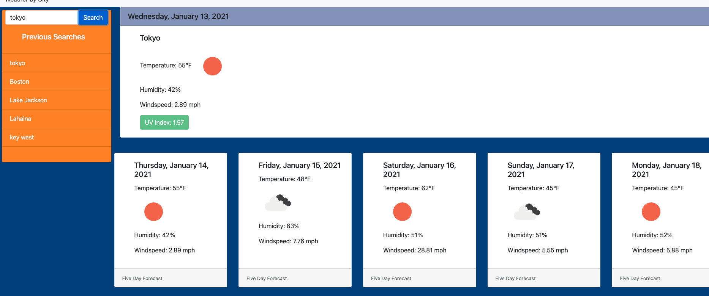

# jasdjames-weather-api
## Description
The intended purpose of this project to create a weather app with Open Weather API. The app gives the 5 day forecast and daily forecast for searched city. The sidebar holds the previous searches and can be reloaded by clicking on the name. 

## Installation
This project is listed in the the GitHub repository at this is link [GitHub Repository] (https://github.com/jasdjames/jasdjames-weather-api)

This page has been deployed here [Page] (https://jasdjames.github.io/jasdjames-weather-api/)

 

## Usage
The page functions mostly as it should. The names do not append to the "previous searches" exactly as I would have liked and as I would have completed with more time and research. 

## Credits
 Will Utterback has grown to someone that it is easy to collaborate with on projects. I bounces ideas off of him to see if they would work. He also helped me to see things in other ways. 

## References

![Luxon-YouTube] (https://www.youtube.com/watch?v=U4GJA7pY0O0&t=300s)

Luxon and JQuery documentation 

[Jquery.empty](https://api.jquery.com/empty/)

[Epa](https://www.epa.gov/sunsafety/uv-index-1)

[Stringify local storage ](https://stackoverflow.com/questions/17745292/how-to-retrieve-all-localstorage-items-without-knowing-the-keys-in-advance)
[removing duplicates from array ](https://stackoverflow.com/questions/9229645/remove-duplicate-values-from-js-array)
## License
MIT License

Copyright (c) [2020] [JasDJames]

Permission is hereby granted, free of charge, to any person obtaining a copy of this software and associated documentation files (the "Software"), to deal in the Software without restriction, including without limitation the rights to use, copy, modify, merge, publish, distribute, sublicense, and/or sell copies of the Software, and to permit persons to whom the Software is furnished to do so, subject to the following conditions:

The above copyright notice and this permission notice shall be included in all copies or substantial portions of the Software.

THE SOFTWARE IS PROVIDED "AS IS", WITHOUT WARRANTY OF ANY KIND, EXPRESS OR IMPLIED, INCLUDING BUT NOT LIMITED TO THE WARRANTIES OF MERCHANTABILITY, FITNESS FOR A PARTICULAR PURPOSE AND NONINFRINGEMENT. IN NO EVENT SHALL THE AUTHORS OR COPYRIGHT HOLDERS BE LIABLE FOR ANY CLAIM, DAMAGES OR OTHER LIABILITY, WHETHER IN AN ACTION OF CONTRACT, TORT OR OTHERWISE, ARISING FROM, OUT OF OR IN CONNECTION WITH THE SOFTWARE OR THE USE OR OTHER DEALINGS IN THE SOFTWARE.
## Resources 
